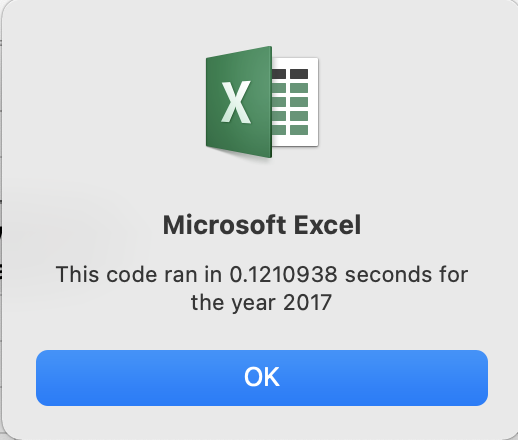

# **Module 2 Challenge: Stocks-Analysis**

## **Overview of the Project**

#### The purpose of this project is to increase the efficiency of an existing Stocks Analysis VBA script to run faster so that it can be used to analyze the dataset of the entire stock market without taking a long time to execute.  The way to do this is by Refactoring the existing VBA script.  In this project, the refactored VBA script is named "All Stocks Analysis Refactored" saved in Module2 in the VBA Developer and the results are presented on the worksheet called "All Stocks Analysis Refactored."  Both are saved in the VBA_Challenge.xlsm

## **Results**

#### The refactoring was done by creating an Index called tickerIndex.  Without indexing, the script has to loop through every single row to sum up ticker volumes and run conditions to determine starting price and ending price and calculating the return for each array value.  With indexing there is no need to access each row in the database, thus it provides faster data search and retrieval.

#### On the pictures of message boxes below we can see the comparison run tme of the script before and after refactoring was done for both 2017 and 2018 data.  After refactoring by adding a ticker index, the processing times are significantly faster.

 

 

 

 

#### Below are some of the codes that show how the indexing was done.  Complete VBA codes can be seen in the excel file.

Sub AllStocksAnalysisRefactored()
    Dim startTime As Single
    Dim endTime  As Single

    yearValue = InputBox("What year would you like to run the analysis on?")

    startTime = Timer
    
    'Format the output sheet on All Stocks Analysis worksheet
    Worksheets("All Stocks Analysis Refactored").Activate
    
    Range("A1").Value = "All Stocks (" + yearValue + ")"
    
    'Create a header row
    Cells(3, 1).Value = "Ticker"
    Cells(3, 2).Value = "Total Daily Volume"
    Cells(3, 3).Value = "Return"

    'Initialize array of all tickers
    Dim tickers(12) As String
    
    tickers(0) = "AY"
    tickers(1) = "CSIQ"
    tickers(2) = "DQ"
    tickers(3) = "ENPH"
    tickers(4) = "FSLR"
    tickers(5) = "HASI"
    tickers(6) = "JKS"
    tickers(7) = "RUN"
    tickers(8) = "SEDG"
    tickers(9) = "SPWR"
    tickers(10) = "TERP"
    tickers(11) = "VSLR"
    
    'Activate data worksheet
    Worksheets(yearValue).Activate
    
    'Get the number of rows to loop over
    RowCount = Cells(Rows.Count, "A").End(xlUp).Row
    
    '1a) Create a ticker Index
    Dim tickerIndex As Integer
    tickerIndex = 0

    '1b) Create three output arrays
    Dim tickerVolumes(12) As Long
    Dim tickerStartingPrices(12) As Single
    Dim tickerEndingPrices(12) As Single
    
    '2a) Create a for loop to initialize the tickerVolumes to zero.
    For i = 0 To 11
        tickerVolumes(i) = 0
    Next i
        
    '2b) Loop over all the rows in the spreadsheet.
        
    For i = 2 To RowCount
    
        '3a) Increase volume for current ticker
        tickerVolumes(tickerIndex) = tickerVolumes(tickerIndex) + Cells(i, 8).Value
        
        '3b) Check if the current row is the first row with the selected tickerIndex.
        'If  Then
        If Cells(i - 1, 1).Value <> tickers(tickerIndex) And Cells(i, 1).Value = tickers(tickerIndex) Then
        tickerStartingPrices(tickerIndex) = Cells(i, 6).Value
        End If
        
        'End if
        
        '3c) check if the current row is the last row with the selected ticker
         'If the next row’s ticker doesn’t match, increase the tickerIndex.
        'If  Then
      
        If Cells(i + 1, 1).Value <> tickers(tickerIndex) And Cells(i, 1).Value = tickers(tickerIndex) Then
        tickerEndingPrices(tickerIndex) = Cells(i, 6).Value
        
        End If

            '3d Increase the tickerIndex.
            If Cells(i, 1).Value = tickers(tickerIndex) And Cells(i + 1, 1).Value <> tickers(tickerIndex) Then
            tickerIndex = tickerIndex + 1
            
       End If
       
        'End If
    
    Next i
    
    '4) Loop through your arrays to output the Ticker, Total Daily Volume, and Return.
    For i = 0 To 11
        
        Worksheets("All Stocks Analysis Refactored").Activate
        Cells(4 + i, 1).Value = tickers(i)
        Cells(4 + i, 2).Value = tickerVolumes(i)
        Cells(4 + i, 3).Value = tickerEndingPrices(i) / tickerStartingPrices(i) - 1
              
    Next i

## **Summary**

### **Advantages and Disadavantages of refactoring in general**

#### The most obvious advantage is the shorter processing time as can be seen in run time result pictures earlier. Other advantageous are the scripts are less complex and easier to read and easier to maintain.  For example, with refactoring by adding an index, we don't need to write nested loops codes.

#### The disadvantages are it could be time consuming trying to understand someone else code and making the changes, it could be costly, and chance of mistakes if the codes are complicated.

### **Advantages and Disadvantages of the original and refactored VBA script**

#### In addition to run the script faster, refactoring also help to simplify the the way the script is written.  With refactoring, an index was created therefore there is no need to use nested loops in the script like in the original vba script.

#### Personaly, I don't see much disadvantage in refactoring the Stock Analysis VBA script except it was confusing at first and a bit time consuming.

